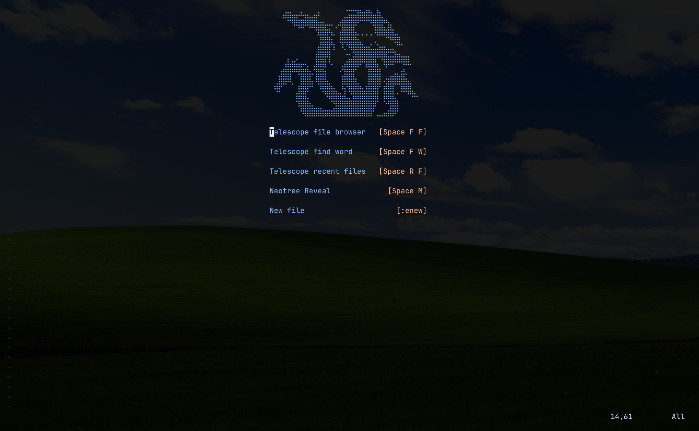

# Gvln-S Neovim Configuration

A comprehensive, modular, and performance-oriented **Neovim** configuration built with **Lazy.nvim**.

This configuration is designed for **Full Stack Development** (Java, Web, Python, Low-Level Programming) and **Systems Programming** (C++, Bash), robust LSP integration via **Mason**, and seamless Git integration.


## Features

- **Package Management**: Powered by [lazy.nvim](https://github.com/folke/lazy.nvim) for fast startup times.
- **LSP Support**: Auto-configured Language Servers for Java, C++, C, Python, Lua, TypeScript, JavaScript HTML, CSS, Bash, ASM using [Mason](https://github.com/williamboman/mason.nvim).
- **Advanced Java Support**: Dedicated `jdtls` setup with debugging, refactoring, and Maven/Gradle support.
- **UI & Aesthetics**:
- **File Explorer**: Neo-tree with git integration and icons.
- **Navigation**: Telescope for fuzzy finding files, buffers, and text.
- **Syntax Highlighting**: Tree-sitter for better syntax highlighting and context.
- **Formatting & Linting**: `none-ls` integration for Prettier and StyLua.
- **LaTeX**: Windows-optimized setup with VimTex and SumatraPDF support.
- **Theme**: Catppuccin.

##  Prerequisites

Before installing, ensure you have the following installed on your system:

- **Neovim** [(v0.9.0 or later)](https://www.reddit.com/r/debian/comments/188d3wc/neovim_on_debian/)
- **Git**
- **Ripgrep** (required for Telescope live grep).
- **C Compiler** (GCC or Clang, required for Tree-sitter parsers).
- **A Nerd Font** (e.g., [JetBrainsMono Nerd Font](https://www.nerdfonts.com/)) for icons.

### Language Specific Requirements
- **Java**: JDK 17 or higher (Config defaults to JDK 23).
- **Node.js & npm**: Required for installing Mason packages (LSP/Formatters).
- **Windows Users**:
  - **LLVM/Clang**: For C++ support (Config expects `C:\Program Files\LLVM\bin`).
  - **SumatraPDF**: For LaTeX preview.

## Installation

1.  **Clone the repository:**
    ```bash
    # Windows (PowerShell)
    git clone https://github.com/Gvln-S/Nvim_Gvln-S_Config.git ~/AppData/local/nvim

    # Linux / MacOS
    git clone https://github.com/Gvln-S/Nvim_Gvln-S_Config.git ~/.config/nvim
    ```

3.  **Start Neovim:**
    Open `nvim`. `lazy.nvim` will automatically bootstrap and install all plugins. Restart Neovim once the installation is complete.

## Important Configuration Required

**Windows Users:**
This configuration contains hardcoded paths specific to the original author's machine. You **must** update these files to match your system paths for these features to work:

1.  **Java (JDTLS):**
    * Open `ftplugin/java.lua`.
    * Update the `path` in the `runtimes` section to point to your JDK installation (currently set to `C:\\Program Files\\Java\\jdk-23`).
    * Ensure the `mason_path` points to your correct user directory if necessary.

2.  **LaTeX (Vimtex):**
    * Open `lua/plugins/nvim-vimtex.lua`.
    * Update `vim.g.vimtex_view_general_viewer` to point to your SumatraPDF executable (currently `C:/Users/Gvln-S/AppData/...`).

3.  **C++ (Clangd):**
    * Open `lua/plugins/lsp-config.lua`.
    * Check the `clangd` setup. It points to `C:/msys64/mingw64/bin/clangd.exe`. Adjust this if you use a different compiler path or LLVM.

## Keymaps

The **Leader key** is set to `Space`.

### General
| Key | Description |
| --- | --- |
| `<C-h/j/k/l>` | Navigate between splits |
| `<leader>wqa` | Save all and quit |
| `<leader>ww` | Save current file |
| `<leader>sx` | Close split |
| `<leader>sh/sl` | Resize split (width) |
| `<leader>sj/sk` | Resize split (height) |

### File Management (Neo-tree)
| Key | Description |
| --- | --- |
| `<leader>m` | Open File Explorer (Left) |
| `<leader>n` | Close File Explorer |

### Telescope (Search)
| Key | Description |
| --- | --- |
| `<leader>tff` | Find files |
| `<leader>tfw` | Live grep (find text) |
| `<leader>tfb` | Find open buffers |
| `<leader>trf` | Recent files |

### LSP & Code
| Key | Description |
| --- | --- |
| `K` | Hover documentation |
| `<leader>df` | Go to definition |
| `<leader>rf` | Find references |
| `<leader>ca` | Code actions |
| `<leader>rn` | Rename symbol |
| `<leader>gf` | Format file (Prettier/Stylua) |

### Java Specific
| Key | Description |
| --- | --- |
| `<leader>oi` | Organize imports |
| `<leader>ev` | Extract variable |
| `<leader>em` | Extract method |

### Git
| Key | Description |
| --- | --- |
| `<leader>fg` | Open Git Graph (Flog) |
| `<leader>gb` | Toggle Git Blame |

## Plugin Structure

The configuration is organized into modules:
* `lua/core/`: Basic Vim options and global keymaps.
* `lua/plugins/`: Individual plugin configurations managed by Lazy.
    * `lsp-config.lua`: Main LSP setup with Mason, including specific configurations for `clangd` and diagnostics.
    * `nvim-cmp.lua`: Autocompletion engine featuring snippet support and custom window borders.
    * `tree-sitter.lua`: Syntax highlighting and context-aware headers via `nvim-treesitter-context`.
    * `nvim-telescope.lua`: Fuzzy finder for files, live grep, and UI selection themes.
    * `nvim-neoTree.lua`: File explorer with Git status integration and automatic file following.
    * `lua-line.lua`: Status line configuration using the Catppuccin theme.
    * `nvim-alpha.lua`: Startup dashboard (Doom theme) with quick-access keys for Telescope and Neo-tree.
    * `nvim-autopairs.lua`: Automatic pairing of brackets and quotes, integrated with Tree-sitter.
    * `nvim-catppuccin.lua`: Main colorscheme configuration with transparent background enabled.
    * `nvim-commentary.lua`: Streamlined code commenting utilities.
    * `nvim-gitStuff.lua`: Comprehensive Git integration including Fugitive, Flog (Git Graph), and Git Blame.
    * `nvim-indentBlankline.lua`: Visual indentation guides, with specific overrides for HTML files.
    * `nvim-noneLs.lua`: Formatting and linting integration for tools like Prettier and StyLua.
    * `nvim-vimtex.lua`: Specialized LaTeX support, optimized for Windows with SumatraPDF integration.
* `ftplugin/`: Filetype-specific settings.
    * `java.lua`: Specialized JDTLS configuration for a professional Java development environment.

Feel free to fork this repository and add your own tweaks to personalize it to your tastes; contributions and customizations are always welcome!


